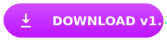

<div align="center">

  

  <h1 align="center" style="border-bottom: none;">LORAPOK PLAYER</h1>
  <p align="center" style="font-weight: bold; color: #00F3FF; letter-spacing: 2px;">SUPERCOMPUTING MEDIA ENGINE</p>

  <p align="center">
    <a href="https://github.com/Maijied/Lorapok_Media_Player"></a>
    <a href="LICENSE"></a>
    <a href="https://github.com/Maijied/Lorapok_Media_Player"></a>
  </p>

  <p align="center" style="max-width: 600px; margin: 20px auto; line-height: 1.6; opacity: 0.8;">
    The next-generation media player blending <b>biological aesthetics</b> with <b>supercomputing performance</b>.
    Engineered for ultra-low latency playback and high-fidelity sensory experiences.
  </p>

  <div align="center" style="margin: 30px 0;">
    <a href="https://maijied.github.io/Lorapok_Media_Player/">
      
    </a>
    &nbsp;&nbsp;
    <a href="https://github.com/Maijied/Lorapok_Media_Player/releases/latest">
      
    </a>
  </div>

  <br />

  

  <br />

  <div style="display: flex; justify-content: center; gap: 10px; flex-wrap: wrap; margin-top: 20px;">
     
     
     
  </div>

</div>

---

## 🧬 ENGINE CAPABILITIES

| Feature | Description | Status |
| :--- | :--- | :--- |
| **Neural Decoding V2** | High-performance FFmpeg-powered pipeline for MKV, AVI, WMV, and FLV. | 🟢 Ready |
| **Universal Stream** | Native HLS (.m3u8) and DASH (.mpd) support with zero-buffer track switching. | 🟢 Ready |
| **Robust Probing** | Intelligent metadata discovery (FFprobe) for 100% accurate duration/seeking. | 🟢 Ready |
| **Organic UI** | Dynamic ambient lighting engine that reacts to video colors in real-time. | 🟢 Ready |
| **Smart Resume** | Atomic position tracking to resume playback exactly where you left off. | 🟢 Ready |
| **Hardware Accel** | GPU-accelerated rasterization for buttery smooth 4K/8K playback. | 🟢 Ready |

---

## 🖥 SYSTEM REQUIREMENTS

### Desktop Application
| Component | Minimum Requirement | Recommended |
| :--- | :--- | :--- |
| **OS (Windows)** | Windows 10 (Build 19041+) | Windows 11 |
| **OS (macOS)** | macOS 12.0 (Monterey) | macOS 14.0 (Sonoma) |
| **OS (Linux)** | Ubuntu 22.04+, Debian 11+ | Latest Fedora / Arch |
| **Processor** | Dual Core 2.0GHz | Quad Core 3.0GHz+ |
| **Memory** | 4 GB RAM | 8 GB RAM+ |
| **Graphics** | DirectX 11 / OpenGL 4.1 | NVIDIA GTX 1050 / Apple M1+ |

### Development Environment
- **Node.js**: v20.x or higher (LTS recommended)
- **NPM**: v10.x or higher
- **Git**: Latest version for source control

---

## 🎹 KEYBOARD SHORTCUTS

### Playback
- `SPACE` : Play / Pause
- `← / →` : Seek 5s
- `[ / ]` : Set A-B Loop
- `\` : Clear Loop
- `N / P` : Next / Prev File

### Tools
- `S` : Screenshot
- `Shift + S` : Burst Mode
- `Ctrl + Shift + C` : Copy Frame
- `C` : Clip It (Export)
- `Ghost` : Incognito Mode

### Audio & Window
- `↑ / ↓` : Volume Up / Down
- `M` : Mute
- `F` : Toggle Fullscreen
- `A` : Aspect Ratio
- `Alt + C` : Local Casting
- `?` : Toggle Help

---

## 📦 INSTALLATION & USAGE

### 1. Download Pre-built (Recommended)
Simply grab the latest installer for your OS from the [Releases Page](https://github.com/Maijied/Lorapok_Media_Player/releases/latest).

### 2. NPM Package for Developers
Integrate the Lorapok Player core into your own React applications.

```bash
npm install lorapok-player
```

```tsx
import { LorapokPlayer } from 'lorapok-player';
import 'lorapok-player/style.css';

const App = () => (
  <LorapokPlayer 
    src="https://example.com/stream.m3u8" 
    className="rounded-2xl"
  />
);
```

### 3. Build from Source
```bash
# Clone the repository
git clone https://github.com/Maijied/Lorapok_Media_Player.git
cd Lorapok_Media_Player

# Install all dependencies
npm install

# Start development mode
npm run dev:electron

# Build production binaries
npm run build
```

---

## 🏗 TECH STACK
- **Core**: React 18, TypeScript, Tailwind CSS
- **Runtime**: Electron 30
- **Animations**: Framer Motion
- **Media Engine**: HLS.js, Dash.js, Fluent-FFmpeg
- **Icons**: Lucide React

---

## 📜 LICENSE

[MIT](LICENSE) © 2026 Lorapok Team. The core media engine and biological aesthetics are optimized for high-performance open computing.