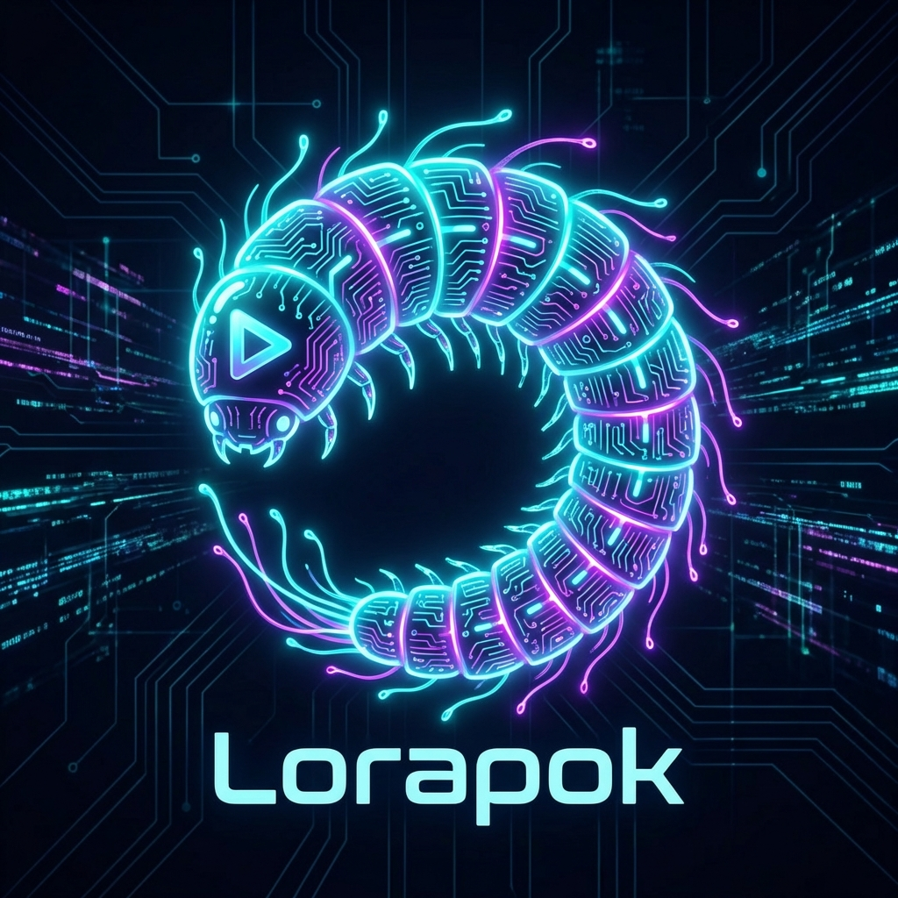
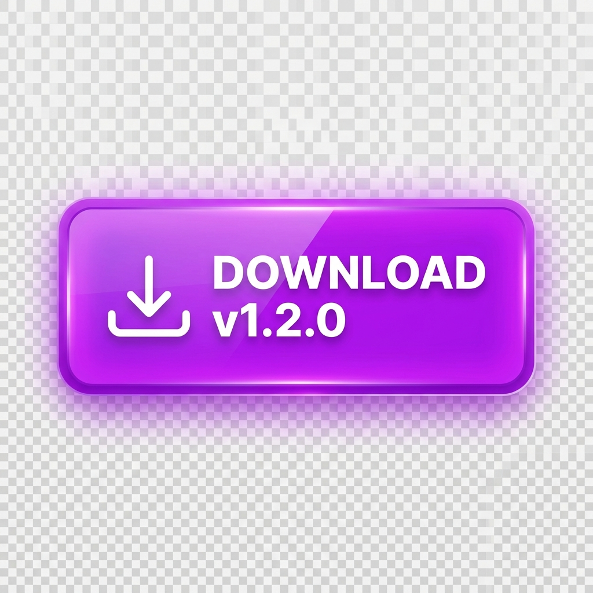
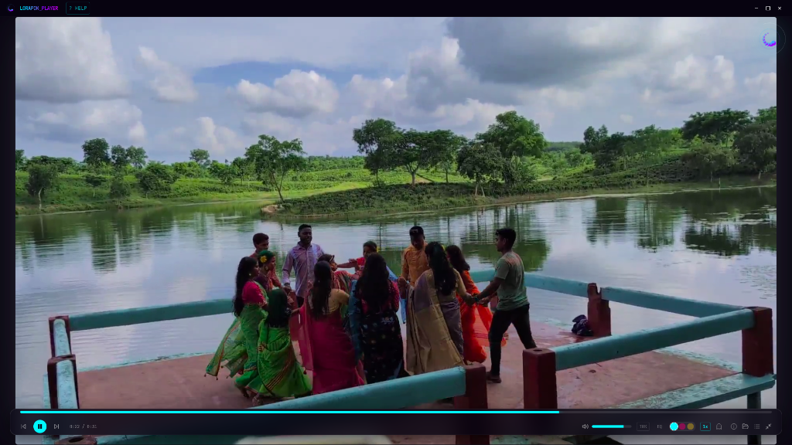
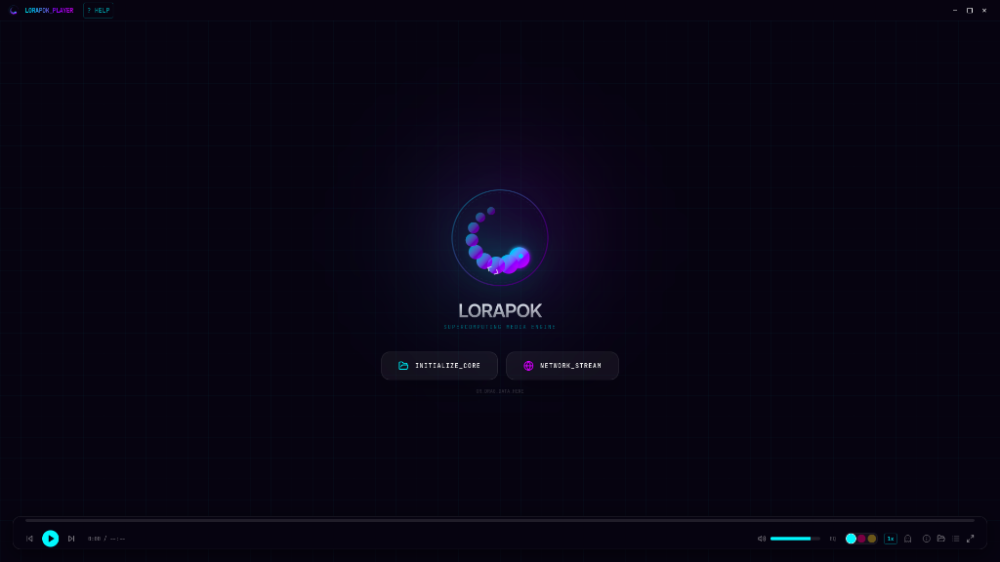
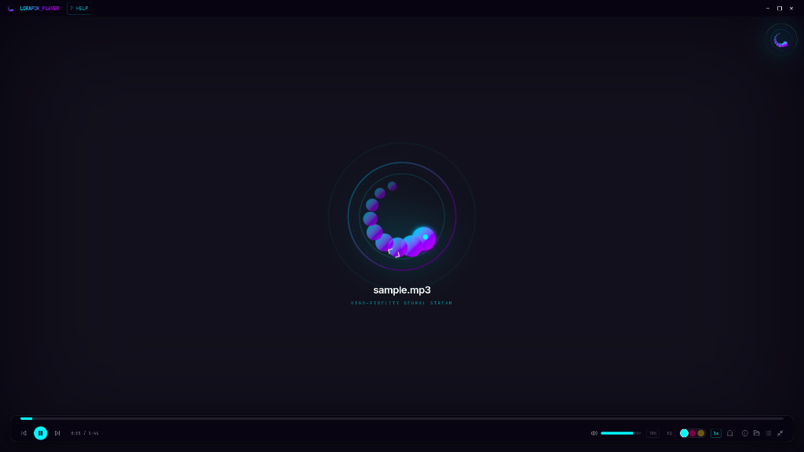
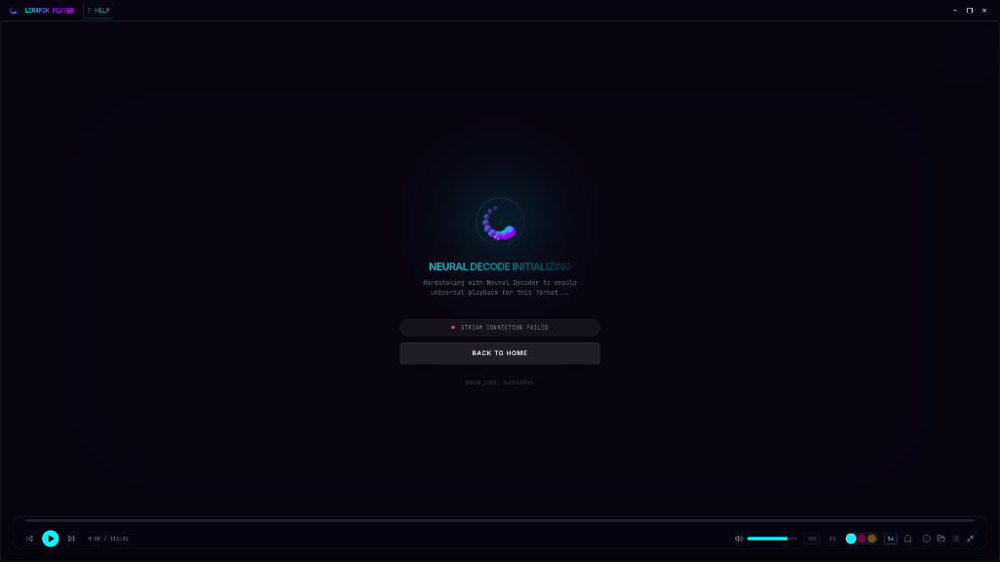

<div align="center">

  

  # LORAPOK PLAYER
  ### SUPERCOMPUTING MEDIA ENGINE

  <p align="center">
    <a href="https://maijied.github.io/Lorapok_Media_Player/">
      
    </a>
    <a href="https://github.com/Maijied/Lorapok_Media_Player/releases/latest">
      
    </a>
  </p>

  <p align="center">
    The next-generation media player blending <b>biological aesthetics</b> with <b>supercomputing performance</b>.
    <br />
    Built for the modern web and desktop.
  </p>

  <br />

  
  
  <br/><br/>

  <div style="display: flex; justify-content: center; gap: 10px; flex-wrap: wrap;">
     
     
     
  </div>

</div>

---

## 🧬 CORE FEATURES

- **Neural Decoding**: Advanced playback engine supporting all major formats (MKV, AVI, WMV) via FFmpeg-powered server-side transcoding.
- **Robust Duration**: Intelligent metadata probing (FFprobe) ensures accurate progress bar and total length for all streaming and buffered videos.
- **Seamless Track Switching**: Runtime Audio and Subtitle track selection for HLS streams—switch instantly without re-buffering.
- **Organic UI**: A "living" interface that reacts to media content with dynamic ambient lighting and micro-animations.
- **Universal Drop**: Drag-and-drop any media file or network URL to instantly initialize playback with automatic path normalization.
- **Smart Resume**: Automatically remembers and resumes playback position for every media file.
- **Screenshots**: High-resolution frame capture via the `S` shortcut (saved to `Pictures/Lorapok`).
- **Theme Presets**: Switch between **Midnight Core**, **Cyber Bloom**, and **Quantum Pulse** aesthetics.
- **Aspect Ratio Control**: VLC-style aspect ratio cycling (16:9, 4:3, 5:4, 21:9, 1:1, etc.) using the `A` shortcut.
- **Cross-Platform**: Optimized builds for Windows, macOS, and Linux.

## 📦 COMPONENT LIBRARY

Lorapok Player is also available as a standalone React component for web developers.

```bash
npm install lorapok-player
```

```tsx
import { LorapokPlayer } from 'lorapok-player';
import 'lorapok-player/style.css';

function App() {
  return (
    <LorapokPlayer
      src="https://example.com/video.mp4"
      className="w-full aspect-video rounded-xl"
    />
  );
}
```

## 🚀 DEVELOPMENT

### Desktop App (Electron)

```bash
# Install dependencies
npm install

# Start development server
npm run dev:electron

# Build for production
npm run build:electron
```

### Website

```bash
cd packages/website
npm install
npm run dev
```

## 🏗 ARCHITECTURE

- **Frontend**: React, TypeScript, Tailwind CSS, Framer Motion
- **Runtime**: Electron (Main + Renderer Process Isolation)
- **Media Engine**: Fluent-FFmpeg + Custom Protocol Handler (`media://`)

## 📜 LICENSE

[MIT](LICENSE) © 2026 Lorapok Team