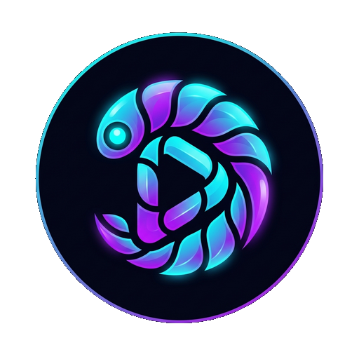
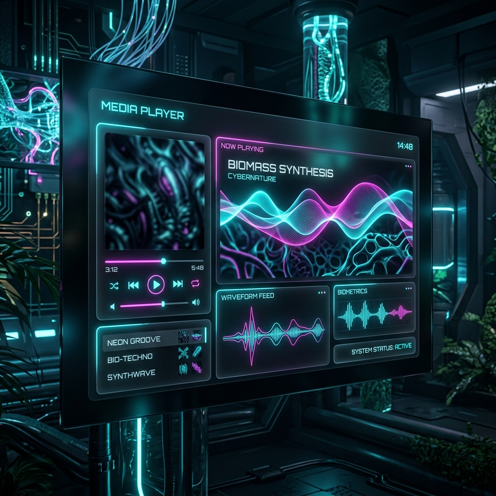
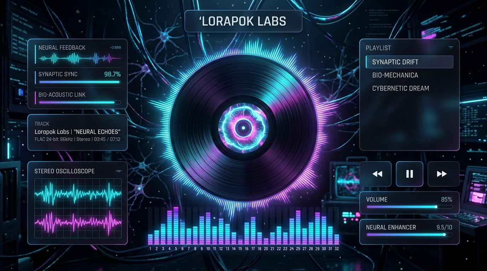
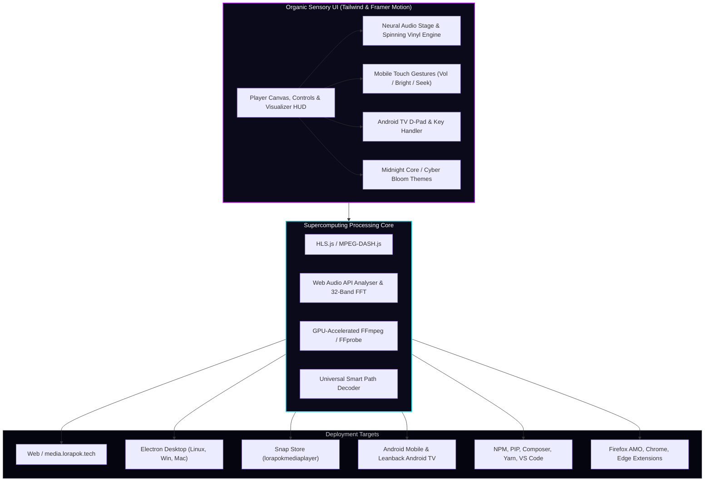

<div align="center">

  

  <h1 align="center" style="border-bottom: none;">LORAPOK PLAYER</h1>
  <p align="center" style="font-weight: bold; color: #00F3FF; letter-spacing: 2px;">SUPERCOMPUTING SENSORY MEDIA ENGINE BY LORAPOK LABS</p>

  <p align="center">
    <a href="https://github.com/Maijied/Lorapok_Media_Player/releases/tag/v1.5.0"></a>
    <a href="LICENSE"></a>
    <a href="https://media.lorapok.tech"></a>
    <a href="https://github.com/Maijied/Lorapok_Media_Player/actions/workflows/workflow-unified.yml"></a>
  </p>

  <p align="center">
    <a href="https://snapcraft.io/lorapokmediaplayer">
      
    </a>
  </p>

  <p align="center" style="max-width: 650px; margin: 20px auto; line-height: 1.6; opacity: 0.85;">
    The next-generation sensory media engine blending <b>biological aesthetics</b> with <b>supercomputing neural performance</b>.
    Engineered for ultra-low latency 8K video decoding, lossless audio equalization, and high-fidelity sensory experiences across Desktop, Android, and Web.
  </p>

  <div align="center" style="margin: 25px 0;">
    <a href="https://media.lorapok.tech">
      
    </a>
    &nbsp;&nbsp;
    <a href="https://github.com/Maijied/Lorapok_Media_Player/releases/tag/v1.5.0">
      
    </a>
  </div>

  <br />

  

  <br />

  <div style="display: flex; justify-content: center; gap: 15px; flex-wrap: wrap; margin-top: 25px;">
     
  </div>

</div>

---

## 🧬 ENGINE CAPABILITIES

| Feature | Description | Platform / Engine |
| :--- | :--- | :--- |
| **8K / 4K 60FPS Video** | Hardware GPU-accelerated decoding (VA-API, NVDEC, Vulkan, Direct3D 11, Metal). | Desktop & Android |
| **Adaptive Neural Stream** | Native HLS (`.m3u8`) & MPEG-DASH (`.mpd`) stream engine with zero-rebuffer switching. | Web, Desktop, VS Code |
| **Real-Time Audio Visualizer** | 32-band dynamic FFT frequency spectrum equalizer with glowing neon peak caps & harmonic pulse. | All Targets |
| **Neural Audio Stage** | Holographic spinning vinyl disc animation, stereo oscilloscope, and studio metadata rendering. | Web & Desktop |
| **Android TV & Leanback** | TV launcher, D-Pad directional navigation, 150% volume boost, and vertical swipe gestures. | Android Mobile & TV |
| **Instant Fuzzy Search** | Global search (`⌘K` / `Ctrl+K`) for local media files, stream links, and demo presets. | All Surfaces |
| **Folder Ingestion & Playlists**| Drag-and-drop folders, directory tree parsing, track shuffling (`🔀`), and repeat modes (`🔁`). | Web & Desktop |
| **Organic Sensory UI** | Real-time ambient backlight sampling with Cyberpunk & Midnight theme matrices. | All Surfaces |

---

## 🏗 ECOSYSTEM PACKAGES & INSTALLATION

### 1. 🐧 Snap Store (Universal Linux)
[](https://snapcraft.io/lorapokmediaplayer)

```bash
sudo snap install lorapokmediaplayer
```

### 2. 💻 Visual Studio Code Extension
Search **"Lorapok"** in the VS Code Extensions Marketplace or install the `.vsix` package:
```bash
code --install-extension lorapok-player-vscode-1.5.0.vsix
```

### 3. 🐍 Python Package (PyPI / CLI / Embed)
```bash
pip install lorapok
```
```python
import lorapok

# Launch standalone GUI media engine
lorapok.play("https://test-streams.mux.dev/x36xhzz/x36xhzz.m3u8")
```

### 4. 🐘 PHP Composer
```bash
composer require lorapok/player
```
```php
use Lorapok\LorapokPlayer;

echo LorapokPlayer::render([
    'src' => 'https://test-streams.mux.dev/x36xhzz/x36xhzz.m3u8',
    'theme' => 'midnight-core'
]);
```

### 5. 📦 NPM / Yarn React Library
```bash
npm install lorapok-player
# or
yarn add lorapok-player
```
```tsx
import { LorapokPlayer } from 'lorapok-player'
import 'lorapok-player/style.css'

export default function App() {
  return <LorapokPlayer src="/demos/neon_waves.mp4" autoPlay />
}
```

### 6. 🦊 Firefox AMO & Chromium Browser Extensions
- **Firefox Add-on**: Download `lorapok-extension-firefox-1.5.0.xpi` for 1-click installation.
- **Chrome / Edge**: Load unpacked `lorapok-extension-chrome-1.5.0.zip` via `chrome://extensions`.

---

## 🖥 SYSTEM ARCHITECTURE


```mermaid
graph TD
    classDef ui fill:#0a0a1a,stroke:#BC13FE,stroke-width:2px,color:#fff;
    classDef engine fill:#0a0a1a,stroke:#00F3FF,stroke-width:2px,color:#fff;
    classDef platform fill:#050510,stroke:#555,stroke-width:1px,color:#ccc;
    
    subgraph UI ["Organic Sensory UI (Tailwind & Framer Motion)"]
        Components["Player Canvas, Controls & Visualizer HUD"]
        AudioStage["Neural Audio Stage & Spinning Vinyl Engine"]
        TouchGestures["Mobile Touch Gestures (Vol / Bright / Seek)"]
        DPad["Android TV D-Pad & Key Handler"]
        Themes["Midnight Core / Cyber Bloom Themes"]
    end
    
    subgraph Engine ["Supercomputing Processing Core"]
        HLS["HLS.js / MPEG-DASH.js"]
        WebAudio["Web Audio API Analyser & 32-Band FFT"]
        FFmpeg["GPU-Accelerated FFmpeg / FFprobe"]
        SmartDec["Universal Smart Path Decoder"]
    end
    
    subgraph Platforms ["Deployment Targets"]
        Web["Web / media.lorapok.tech"]
        Desktop["Electron Desktop (Linux, Win, Mac)"]
        Snap["Snap Store (lorapokmediaplayer)"]
        Android["Android Mobile & Leanback Android TV"]
        Packages["NPM, PIP, Composer, Yarn, VS Code"]
        Extensions["Firefox AMO, Chrome, Edge Extensions"]
    end

    Components --> AudioStage
    Components --> TouchGestures
    Components --> DPad
    Components --> Themes
    UI --> Engine
    
    Engine --> Web
    Engine --> Desktop
    Engine --> Snap
    Engine --> Android
    Engine --> Packages
    Engine --> Extensions
    
    class UI ui;
    class Engine engine;
    class Platforms platform;
```

---

## 🎹 KEYBOARD SHORTCUTS

| Shortcut | Action |
|---|---|
| `SPACE` | Play / Pause playback |
| `←` / `→` | Seek backward / forward 10 seconds |
| `↑` / `↓` | Increase / Decrease volume (10%) |
| `M` | Mute / Unmute audio |
| `F` | Toggle Fullscreen mode |
| `A` | Cycle Aspect Ratio (16:9, 4:3, 21:9, Original) |
| `[` / `]` | Set A-B Loop Start & End points |
| `\` | Clear active A-B Loop |
| `{` / `}` | Cycle playback speed (0.5x, 1x, 1.25x, 1.5x, 2x) |
| `⌘K` / `Ctrl+K` | Open Instant File & Stream Search |
| `?` | Toggle Interactive User Guide |

---

## 📜 LEGAL & PROPRIETARY LICENSE

**Copyright (c) 2026 Lorapok Labs ([https://lorapok.tech](https://lorapok.tech)). All rights reserved.**

This software is an official proprietary product of **Lorapok Labs**, licensed under the **Lorapok Labs Non-Commercial End-User License (LL-NC-1.0)**:

- **Permitted Use**: You are granted a free license to install and use Lorapok Media Player strictly for personal, private, educational, research, and non-commercial multimedia playback.
- **Commercial Prohibition (NOT FOR SALE)**: No individual or corporation may sell, resell, lease, rent, sublicense, monetize, bundle, or exploit this software for commercial gain, paid business applications, or corporate revenue generation without prior express written authorization from Lorapok Labs.
- **Attribution**: All documentation, forks, and distributions must retain the official Lorapok Labs copyright notices and link to [https://lorapok.tech](https://lorapok.tech).

For commercial licensing and enterprise partnerships: [https://lorapok.tech](https://lorapok.tech)
